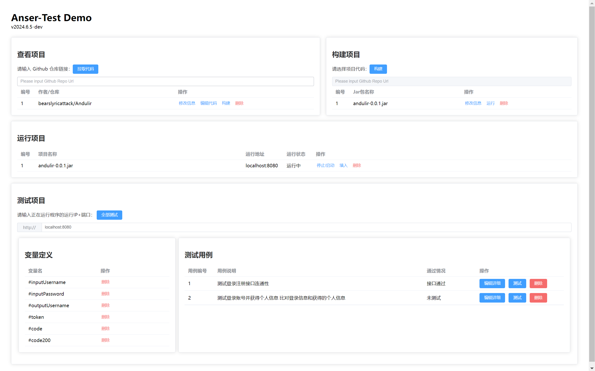

## Anser-Demo 项目简介

安测（AnserTest），一款在线查看Web程序、自动化测试评分系统，用于实验室纳新时的大作业评测；不同于洛谷、力扣等OJ只要求单一程序的正确性，它的核心功能可以：
1. 自动化测试多文件/一个项目代码执行的正确性（可以参考gradescope）
2. 将Web项目自动化部署运行起来，测试接口业务逻辑的连通性与正确性（优先开发）
3. 将项目的代码风格、项目结构、项目所用的技术栈进行综合性评测。

在项目的一阶段，AnserTest 面向的用户为实验室内批作业的同学，主要专注于：
1. 用户可以通过本系统在线拉取并查看候选人在远程仓库的的代码；
2. 用户可以通过本系统选择候选人的代码，自动化构建、部署候选人的后端项目；
3. 用户可以通过本系统编写测试用例，自动化测试所有候选人后端项目的接口。

目前项目打算以两种形式并行开发：
- Demo项目：主项目单体Springboot+前后端不分离，主要用于主要功能设计 + 实现 + 初步演示，不需要保证bug free与稳定性。
- 正式项目：用于正式部署使用，计划为微服务 + Docker容器，目前尚未开发。

## Anser-Demo 项目运行展示



## Anser-demo 环境配置

- 环境需求：Java1.8 + Docker 24.0.7
- 选定一个拉取代码仓库的路径 `repoPath`

### Anser-demo 配置

- 将 `application.yml` 文件中`asner.repoPath`改成上文的 `repoPath`

### Docker 配置

1. 参照Docker官方文档，安装Docker Desktop
2. 在`repoPath`路径下运行：

```
docker run -it --init -p 3000:3000 -v "$(pwd):/home/workspace:cached" gitpod/openvscode-server
```
3. 打开 http://localhost:3000 若成功打开则open-vscode运行成功。

### 启动说明

1. 启动主类 `AnserApplication`
2. 浏览器访问 http://localhost:8085
3. 用户名和密码在 application.yml 里进行查看与修改。